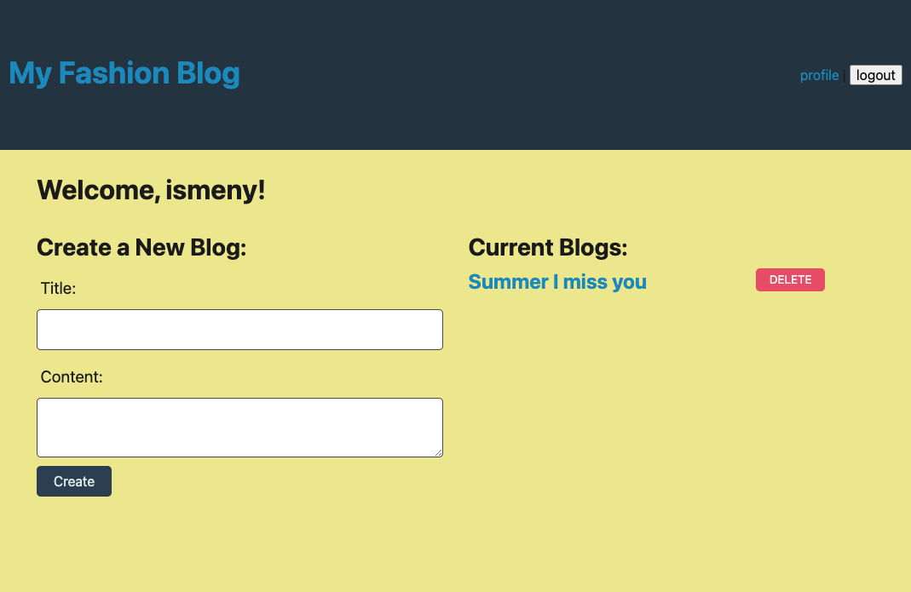
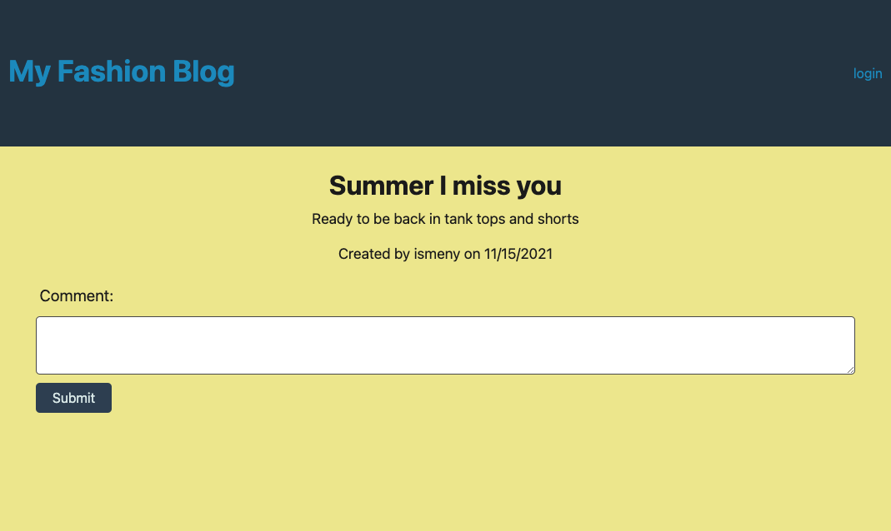

# Homework-14-Tech-Blog

## Description
This application is a blog site where the user can make blog posts and comments.

## Table of contents
  - [Installation](#installation)
  - [Usage](#usage)
  - [Credits](#credits)
  - [License](#license)
  - [Test](#test)
  - [Questions](#questions)
  

## Installation
Heroku URL link  : ***https://fashion-blog-ismeny.herokuapp.com/***  

  
  

  

## Usage
When the user visits the website they will be able to see existing blog posts from other users. If the user wants to create a blog they will have to create an account. Once the new user has an account they will be redirected to a page where they can create new blogs. Once on their own profile they will be able to view their blogs and delete them as well. The use can go back to the homepage and see their blogs along with the existing blogs. The user can select any existing blogs and add comments as well .

## Credits
Received help from:  
Jayla De'nae - peer  
Chuch Stephens - peer  

This application uses:  
Express.js  
MySQL2  
Sequelize  
Bcrypt  
Handlebars  

## License

## Contributions
n/a
## Test
n/a
## Questions
Github: Ismeny Saguilan - https://github.com/Ismeny  
Email: menysag2@gmail.com